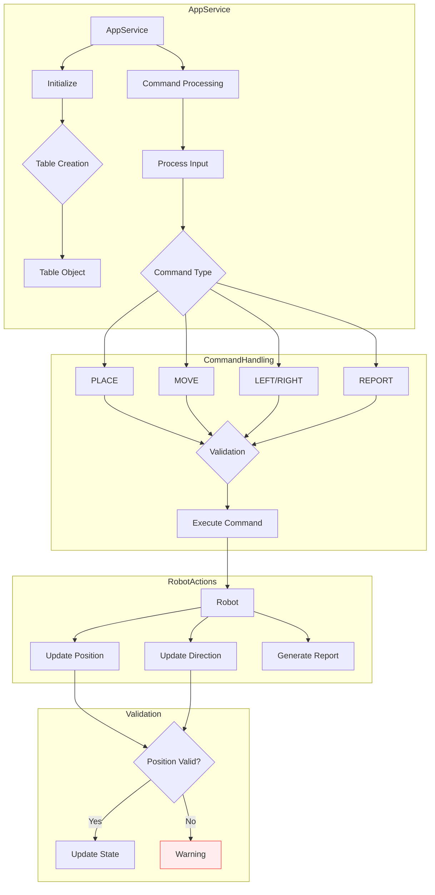

# Toy Robot Simulator

Key features include:
- Placing the robot on the table with a specific position and direction
- Moving the robot one unit forward in the direction it's facing
- Rotating the robot left or right
- Reporting the current position and direction of the robot
- Preventing the robot from falling off the table's edge

# Command-Based Architecture



The application uses a command-based architecture, with separate command classes for each action (PLACE, MOVE, LEFT, RIGHT, REPORT). It also implements interfaces for the robot, table, and direction handling to ensure a modular and extensible design.


## Key Files:
- `app/src/main.ts`: Entry point of the application
- `app/src/app.service.ts`: Main service handling the application logic
- `app/src/commands/`: Directory containing command classes for robot actions
- `app/src/models/`: Directory containing model classes for robot, table, and direction
- `app/src/services/`: Directory containing service classes for command parsing and execution
- `app/package.json`: NPM package configuration
- `app/tsconfig.json`: TypeScript configuration

## Usage Instructions

### Installation

Prerequisites:
- Node.js (version 18 or higher)
- npm (version 8 or higher)

Steps:
1. Clone the repository
2. Navigate to the `app` directory
3. Run `npm install` to install dependencies

### Getting Started

To start the application:

```bash
npm run start:dev
```

This will launch the Toy Robot Simulator. You can then enter commands to control the robot.


### Testing

To run the tests:

```bash
npm run test
```

test coverage:

```bash
npm run test:cov
```


## Data Flow

The application follows this general flow for processing commands:

1. User inputs a command through the command-line interface
2. The `AppService` receives the input and passes it to the `CommandParser`
3. `CommandParser` validates and converts the input into a `Command` object
4. The parsed command is passed to the `CommandExecutor`
5. `CommandExecutor` executes the command on the `Robot` instance
6. The `Robot` updates its state based on the command and the `Table` constraints
7. If it's a REPORT command, the robot's state is output to the console